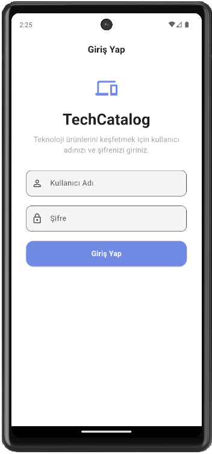
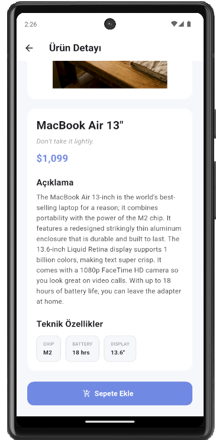
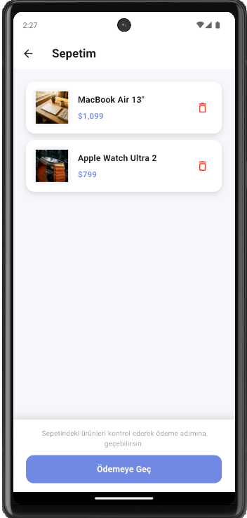
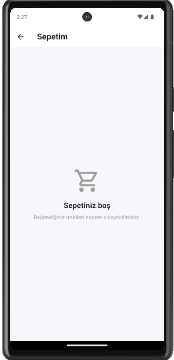

# TechCatalog

TechCatalog, API üzerinden teknoloji ürünlerini listeleyen bir Flutter katalog uygulamasıdır.

## Özellikler

- Ürün listeleme ve arama
- Ürün detay ekranı
- Sepete ürün ekleme ve silme
- Hero geçiş animasyonu
- Basit ödeme simülasyonu

## Kullanılan Teknolojiler

- Flutter
- Dart
- HTTP
- Shared Preferences

## Ekran Görüntüleri

### Giriş Ekranı


### Ana Sayfa


### Ürün Detayı


### Sepet


### Boş Sepet


## Sürümler

- Flutter 3.44.6
- Dart 3.12.2

## Çalıştırma

```bash
flutter pub get
flutter run